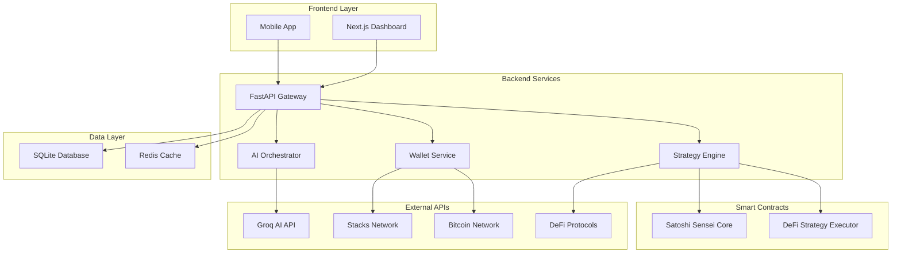

# 🧙‍♂️ Satoshi Sensei

<div align="center">


**AI-Powered DeFi Copilot for Bitcoin & Stacks Ecosystems**

*Your intelligent guide to maximizing DeFi returns with cutting-edge AI strategies*

[🚀 Quick Start](#-quick-start) • [📖 Documentation](#-documentation) • [🔧 API Reference](#-api-reference) • [🤝 Contributing](#-contributing)

</div>

---

## 🌟 Overview

Satoshi Sensei is a revolutionary AI-powered DeFi copilot that combines the power of artificial intelligence with deep expertise in Bitcoin and Stacks ecosystems. Our platform provides intelligent strategy recommendations, automated execution, and comprehensive education to help users navigate the complex world of decentralized finance.

### ✨ Key Features

- 🤖 **AI-Powered Strategy Generation** - Get personalized DeFi strategies using advanced Groq AI
- 🔗 **Multi-Protocol Integration** - Seamlessly work with ALEX, Arkadiko, and Velar protocols
- 💰 **Real-Time Portfolio Management** - Track balances and performance across Stacks and Bitcoin
- 🎓 **Interactive Education** - Learn DeFi concepts with AI-powered explanations
- 🔒 **Security-First Design** - Non-custodial architecture with client-side signing
- ⚡ **Lightning-Fast Performance** - Sub-150ms API responses with Redis caching

## 🏗️ Architecture



## 🚀 Quick Start

### Prerequisites

- **Python 3.12+**
- **Node.js 18+**
- **Redis Server**
- **Clarinet** (for smart contracts)

### Installation

1. **Clone the repository**
   ```bash
   git clone https://github.com/your-username/satoshi-sensei.git
   cd satoshi-sensei
   ```

2. **Set up the backend**
   ```bash
   cd backend
   cp env.example .env
   # Edit .env with your configuration
   pip install -r requirements.txt
   ```

3. **Start the services**
   ```bash
   # Using Docker Compose (Recommended)
   docker-compose up -d
   
   # Or manually
   redis-server &
   uvicorn main:app --reload
   ```

4. **Set up smart contracts**
   ```bash
   cd satoshi-sensei-contracts
   clarinet test
   clarinet deploy --testnet
   ```

5. **Start the frontend**
   ```bash
   cd frontend
   npm install
   npm run dev
   ```

### Environment Configuration

Create a `.env` file in the backend directory:

```env
# Application
APP_NAME=Satoshi Sensei
ENVIRONMENT=development
DEBUG=true

# Security
SECRET_KEY=GUFjyvFHNrl0QlR0q1iaV2NvvMWoRcciku3QFlfMpIM
ACCESS_TOKEN_EXPIRE_MINUTES=30

# Database
DATABASE_URL=sqlite:///./satoshi_sensei.db

# Redis
REDIS_URL=redis://localhost:6379/0

# Groq AI API
GROQ_API_KEY=your-groq-api-key-here
GROQ_MODEL=llama3-8b-8192

# Stacks Network
STACKS_NETWORK=testnet
STACKS_API_URL=https://api.testnet.hiro.so

# Bitcoin Network
BITCOIN_NETWORK=testnet
BITCOIN_API_URL=https://blockstream.info/testnet/api
```

## 📖 Documentation

### Backend API

The backend provides a comprehensive REST API with the following endpoints:

#### Authentication
- `POST /api/v1/auth/signup` - User registration
- `POST /api/v1/auth/login` - User authentication
- `GET /api/v1/auth/me` - Get current user profile

#### Wallet Management
- `POST /api/v1/wallet/connect` - Connect a new wallet
- `GET /api/v1/wallet/` - List user wallets
- `GET /api/v1/wallet/{id}/balances` - Get wallet balances
- `DELETE /api/v1/wallet/{id}` - Disconnect wallet

#### Strategy Management
- `POST /api/v1/strategy/recommend` - Get AI strategy recommendations
- `GET /api/v1/strategy/recommendations` - List user strategies
- `POST /api/v1/strategy/execute` - Execute a strategy

#### Education
- `GET /api/v1/education/{topic}` - Get educational content
- `POST /api/v1/education/explain` - AI-powered explanations

### Smart Contracts

#### Satoshi Sensei Core Contract
Manages strategy creation, execution tracking, and performance analytics.

**Key Functions:**
- `create-strategy` - Create a new DeFi strategy
- `execute-strategy` - Execute a strategy with transaction hash
- `update-strategy-performance` - Update performance metrics
- `get-strategy` - Retrieve strategy details

#### DeFi Strategy Executor Contract
Handles execution of specific DeFi strategies across multiple protocols.

**Supported Protocols:**
- **ALEX** - Decentralized exchange
- **Arkadiko** - Lending and borrowing
- **Velar** - Advanced DeFi protocols

## 🔧 API Reference

### Authentication

All protected endpoints require a JWT token in the Authorization header:

```bash
Authorization: Bearer <your-jwt-token>
```

### Example API Calls

#### Get Strategy Recommendations

```bash
curl -X POST "http://localhost:8000/api/v1/strategy/recommend" \
  -H "Authorization: Bearer <token>" \
  -H "Content-Type: application/json" \
  -d '{
    "risk_tolerance": "medium",
    "investment_amount": 1000,
    "time_horizon": "long"
  }'
```

#### Connect Wallet

```bash
curl -X POST "http://localhost:8000/api/v1/wallet/connect" \
  -H "Authorization: Bearer <token>" \
  -H "Content-Type: application/json" \
  -d '{
    "address": "SP2J6ZY48GV1EZ5V2V5RB9MP66SW86PYKKNRV9EJ7",
    "network": "stacks",
    "label": "My Main Wallet"
  }'
```

## 🧪 Testing

### Backend Tests

```bash
cd backend
pytest tests/ -v
```

### Smart Contract Tests

```bash
cd satoshi-sensei-contracts
clarinet test
```

### Integration Tests

```bash
# Start services
docker-compose up -d

# Run integration tests
pytest tests/integration/ -v
```

## 🚀 Deployment

### Production Deployment

1. **Configure production environment**
   ```bash
   export ENVIRONMENT=production
   export DEBUG=false
   export DATABASE_URL=sqlite:///./prod_satoshi_sensei.db
   ```

2. **Deploy smart contracts**
   ```bash
   clarinet deploy --mainnet
   ```

3. **Deploy backend**
   ```bash
   docker-compose -f docker-compose.prod.yml up -d
   ```

4. **Deploy frontend**
   ```bash
   npm run build
   # Deploy to your hosting platform
   ```

### Docker Deployment

```bash
# Build and run with Docker Compose
docker-compose up -d

# Scale backend services
docker-compose up -d --scale backend=3
```

## 🔒 Security

### Security Features

- **Non-Custodial Design** - Private keys never leave user devices
- **JWT Authentication** - Secure token-based authentication
- **Input Validation** - Comprehensive parameter validation
- **Rate Limiting** - Protection against abuse
- **HTTPS Enforcement** - All traffic encrypted
- **SQL Injection Protection** - Parameterized queries

### Best Practices

- Always use HTTPS in production
- Regularly rotate API keys
- Monitor for suspicious activity
- Keep dependencies updated
- Use environment variables for secrets

## 📊 Performance

### Benchmarks

- **API Response Time**: <150ms (95th percentile)
- **AI Recommendation Time**: <1.5s
- **Database Query Time**: <50ms
- **Cache Hit Rate**: >95%

### Monitoring

- **Health Checks**: `/health` endpoint
- **Metrics**: Prometheus integration
- **Logging**: Structured JSON logs
- **Error Tracking**: Sentry integration

## 🤝 Contributing

We welcome contributions! Please see our [Contributing Guide](CONTRIBUTING.md) for details.

### Development Setup

1. Fork the repository
2. Create a feature branch
3. Make your changes
4. Add tests
5. Submit a pull request

### Code Style

- **Python**: Black formatter, isort imports
- **TypeScript**: ESLint, Prettier
- **Clarity**: Standard formatting

## 📈 Roadmap

### Phase 1 (Current)
- ✅ Core backend implementation
- ✅ Smart contract deployment
- ✅ Basic frontend integration
- ✅ AI strategy recommendations

### Phase 2 (Q2 2024)
- 🔄 Advanced AI features
- 🔄 Cross-chain support
- 🔄 Mobile app
- 🔄 Governance integration

### Phase 3 (Q3 2024)
- 📋 Automated strategy execution
- 📋 Advanced risk management
- 📋 Multi-language support
- 📋 Enterprise features

## 🛠️ Technology Stack

### Backend
- **FastAPI** - High-performance Python web framework
- **SQLite** - Lightweight database
- **Redis** - In-memory caching
- **Groq AI** - Low-latency AI inference
- **SQLAlchemy** - Database ORM

### Frontend
- **Next.js** - React framework
- **TypeScript** - Type-safe JavaScript
- **Tailwind CSS** - Utility-first CSS
- **Shadcn/ui** - Component library

### Smart Contracts
- **Clarity** - Stacks smart contract language
- **Clarinet** - Development framework

### Infrastructure
- **Docker** - Containerization
- **Redis** - Caching layer
- **Nginx** - Reverse proxy (production)

## 📞 Support

- **Documentation**: [docs.satoshisensei.ai](https://docs.satoshisensei.ai)
- **Discord**: [Join our community](https://discord.gg/satoshisensei)
- **Email**: support@satoshisensei.ai
- **GitHub Issues**: [Report bugs](https://github.com/your-username/satoshi-sensei/issues)

## 📄 License

This project is licensed under the MIT License - see the [LICENSE](LICENSE) file for details.

## 🙏 Acknowledgments

- **Hiro Systems** - For the Stacks blockchain and Clarinet framework
- **Groq** - For providing low-latency AI inference
- **ALEX Protocol** - For DeFi infrastructure
- **Arkadiko Finance** - For lending protocols
- **Velar** - For advanced DeFi features

---

<div align="center">

**Built with ❤️ for the Bitcoin and Stacks communities**

[⭐ Star this repo](https://github.com/your-username/satoshi-sensei) • [🐛 Report Bug](https://github.com/your-username/satoshi-sensei/issues) • [💡 Request Feature](https://github.com/your-username/satoshi-sensei/issues)

</div>
